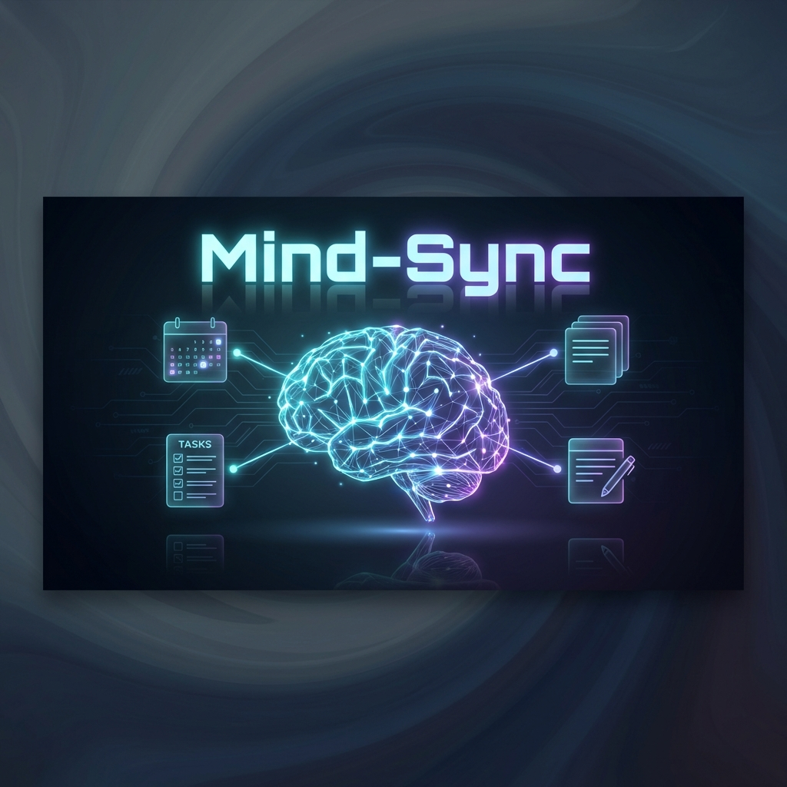

<div align="center">
  

# Mind-Sync

### **The Ultimate AI-Powered Productivity Workspace**

  <p align="center">
    
    
    
    
    
    
  </p>

  <p align="center">
    Mind-Sync is not just a todo list. It's an intelligent "Second Brain" that helps you capture, organize, and execute your life. From real-time meeting transcription to AI-driven scheduling, Mind-Sync keeps you in the flow.
  </p>
</div>

---

## ✨ Key Features

### 🎙️ **Meeting Mode & AI Assistant**

- **Real-time Transcription**: Transcribe meetings live directly in the browser.
- **AI Summaries**: Instantly generate meeting minutes, action items, and key decisions using Google Gemini.
- **Audio Visualizer**: Beautiful real-time audio visualization.

### 🧠 **Second Brain Notes**

- **Split-Pane Editor**: Write and reference notes simultaneously.
- **Rich Text Support**: Full formatting capabilities.
- **Deleted Note Recovery**: Safe deletion handling with database integrity.

### 📅 **Smart Planning**

- **Day Planner**: Drag-and-drop tasks onto your calendar time grid.
- **AI Auto-Schedule**: Let AI analyze your todo list and calendar holes to generate the perfect schedule.
- **Google Calendar Sync**: Two-way synchronization with your primary calendar.

### 🍅 **Focus & Analytics**

- **Zen Mode**: Distraction-free timer with ambient soundscapes (rain, forest, etc.).
- **Productivity Heatmap**: GitHub-style contribution graph for your task completion.
- **Weekly Reports**: Interactive charts visualizing your focus time and goal progress.

## 🚀 Getting Started

### Prerequisites

- Node.js (v18+)
- PostgreSQL Database
- Google Gemini API Key

### Installation

1.  **Clone the repo**

    ```bash
    git clone https://github.com/vaibhav09012007-design/Mind-Sync.git
    cd mind-sync
    ```

2.  **Install dependencies**

    ```bash
    npm install
    ```

3.  **Setup Environment**
    Create a `.env.local` file:

    ```env
    DATABASE_URL="postgres://..."
    NEXT_PUBLIC_CLERK_PUBLISHABLE_KEY="..."
    CLERK_SECRET_KEY="..."
    GEMINI_API_KEY="..."
    ```

4.  **Run Development Server**
    ```bash
    npm run dev
    ```

## 📸 Screenshots

_(Add screenshots here later!)_

---

<div align="center">
  <p>Built with ❤️ by <a href="https://github.com/vaibhav09012007-design">Vaibhav Tiwari</a></p>
</div>
